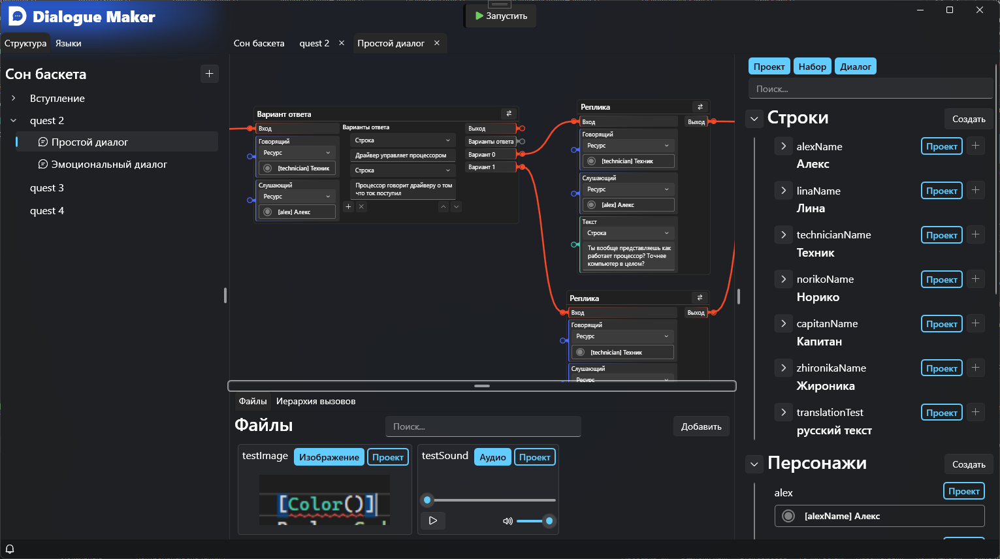

## DialogMaker
Программа для создания диалогов в виде графов



## В чём суть?
Все диалоги компилируются в байткод, который потом и исполняется.
Этот подход уменьшает размер конечного файла диалога, а также ускоряет его загрузку, 
так как почти ничего восстанавливать не приходится. 
В самом байткоде хранятся только индексы ресурсов, которые записываются во время компиляции.
Все доступные оп-коды прописаны здесь: `DialogMaker.Core.Executioning.DialogByteCode`.

## Возможности
В проекте можно задать список языков. Диалоги работают напрямую с ресурсами (справа на картинке). 
Объекты наследуют ресурсы родителей по такой структуре:
1. Проект (глобальные ресурсы)
2. Набор диалогов (ресурсы проекта + свои)
3. Диалог (свои ресурсы + набор диалогов + проект)

Доступны следующие ресурсы:
1. Строки - основной ресурс. Можно добавлять переводы на любые языки, заданные в проекте, а также прикрепить к ним файлы озвучки.
2. Персонажи - это объекты, которые в имени ссылаются на строку
3. Переменные - строки, числа, булевы значения. Их можно менять когда угодно и отслеживать извне.
4. Эмоции - лицевые параметры, например, степень закрытия глаз, поднятие и наклон бровей, подъём уголков рта

## Использование
Проект разделён на 2 части: редактор (WPF, .NET 10) и ядро (библиотека, .NET Standard 2.1).
По сути, редактор - это графический интерфейс к библиотеке. Каждый может взять эту библиотеку и сделать свой редактор.

Есть 2 вида доступа к диалогам. Первый - это редактируемый доступ, как раз тот что используется в редакторе.
С помощью этого способа создаются и редактируются диалоги. Вот пример создания диалога напрямую через код:

```csharp
// Создаём сам проект. Первый аргумент - идентификатор проекта, второй - путь к папке в которой он будет создан
DialogProject project = DialogProject.Create("projectId", "pathToFolder");
// Создаём набор диалогов. Наборы диалогов хранят диалоги, думаю, звучит логично.
DialogProjectPack pack = project.CreatePack("dialogsPackId", "Название набора диалогов");
// Наконец, создаём диалог
DialogProjectDialog dialog = pack.CreateDialog("dialogId", "Название диалога");
```

Но этого явно маловато будет? Давайте добавим в диалог узел, который будет выводить сообщение.
Хотя, нет. Это геморрой и лучше воспользоваться программой. Оно не предназначено для создания диалогов вручную через код - слишком много писать.

Теперь следует показать как вообще работать с итоговыми диалогами.

```csharp
// Читаем и открываем скомпилированный пакет диалогов
DialogPackage package = DialogPackage.Open("pathToFile");
// Набор диалогов = папка диалогов
DialogFolder folder = package["folderId"];
// Получаем сам диалог
Dialog dialog = folder["dialogId"];
```

Перед запуском диалога необходимо реализовать `IDialogExecutingHandler` - это интерфейс обработчика диалогов.
Во время выполнения диалога "виртуальная машина" будет обращаться к этому обработчику, чтобы вы могли обработать поведение диалога.

```csharp
// Создаём исполнитель диалога
DialogExecutor executor = dialog.CreateExecutor();
// Задаём свой обработчик
executor.Handler = new MyDialogExecutingHandler();

// И, наконец, запускаем диалог.
// Здесь в аргументе обозначается сделать ли ресурсы изолированными на время текущего выполнения.
// Если поставить изолированные ресурсы, то значения переменных не будет сохраняться.
// Этот параметр подходит для проверочных запусков, чтобы не ворошить улий.
executor.Start(true);
```

## Важно
Данная программа и библиотека находятся на стадии разработки,
это значит что могут быть внесены изменения, ломающие совместимость с ранее созданными диалогами.
А ещё это значит что многое работает криво или просто ещё не реализовано.